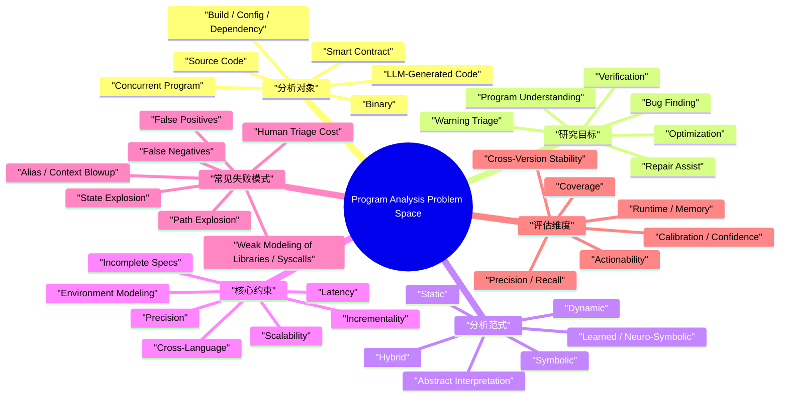

1. 跟风，别人做啥我做啥
2. 映射加迁移，2 个domain, 借鉴一个domain的idea和算法
3. 问题空间，去发现哥德巴赫猜想，seed generation
4. 有一个算法，革新算法，创新

问题空间，给定方法论，搜索潜在idea,(fuzzing seed generation), 

如何去发现哥德巴赫猜想，问chatgpt, 如何提出好的问题，好的idea


你这里其实已经把 research idea 的 4 条主要来源说出来了，而且第 3 条最值钱，也最难。

我先直接给结论：

**“发现哥德巴赫猜想” 不是直接问 ChatGPT 要一个伟大想法，而是用它帮你系统地搜索 problem space 里的异常、张力、边界和未闭合环。**  
如果用你熟悉的 fuzzing 语言说：

- 论文/方法 = `seed`
- 问题空间分析 = `coverage modeling`
- idea 变体生成 = `mutation`
- novelty/feasibility 判断 = `oracle`
- 最有潜力的方向 = `interesting seeds`

**你这 4 种路线，按风险和收益看**

1. `跟风`
优点是低风险、容易出结果。  
缺点是创新弱，通常只是增量。

2. `映射/迁移`
这是很常见也很有效的路线。
比如把 A domain 的方法迁到 B domain，再看哪里失效、哪里需要改。
这类 idea 很适合做第一批候选。

3. `问题空间挖掘`
这是最像“发现哥德巴赫猜想”的。
不是先有算法，而是先发现：
“这里有个一直没被说清的问题”
“这里有个矛盾”
“这里有个大家都默认但其实可疑的假设”
这类 idea 最强，但最依赖 problem space 分析。

4. `已有算法上做革新`
这是“从 method space 出发”的创新。
适合你已经有算法积累的时候，但容易陷入“改算法而不是改问题”。

**如果你想用 fuzzing 思路来做第 3 条，我建议这样做**

**第一步：先定义 problem space，而不是先想方法**
对一个方向，先把这些东西列出来：

- 目标到底是什么
- 现在大家默认怎么做
- 常见 baseline 是什么
- 评价指标是什么
- 已知 failure mode 是什么
- 哪些 trade-off 没法同时满足

你真正要找的，不是“新算法名字”，而是：

- 哪个 failure mode 反复出现但没被正面解决
- 哪个假设大家默认成立，其实未必成立
- 哪两个目标一直冲突
- 哪类场景始终表现差

这就是 problem-space coverage。

**第二步：做 idea seed generation**
你的 seed 不应该只是“论文标题”，而应该来自这几类：

- 反复出现的 limitation
- reviewer 常骂的问题
- benchmark 上长期表现差的子场景
- 不同方法之间互补但没被系统组合的模块
- 一个 domain 有效、另一个 domain 没人试过的机制
- evaluation 盲区

也就是说，seed 最好来自“痛点”，不是来自“灵感”。

**第三步：像 fuzz 一样做 mutation**
对每个 seed，沿这些维度变异：

- 换问题表述
- 换目标函数
- 换 reward/signal
- 换训练范式
- 换模块组合
- 换数据/场景
- 换评估方式
- 加约束或去约束

举个你熟悉的形式：

不是只问  
“这个算法能不能更好？”

而是同时问：

- 如果把它从 online 变 offline，会怎样？
- 如果它只负责 scheduling，不负责 generation，会怎样？
- 如果把优化目标从 coverage 变成 bug novelty，会怎样？
- 如果把 evaluation 从平均性能换成 worst-case，会怎样？

这些就是 research mutation operators。

**第四步：给每个变体一个 cheap oracle**
不要一上来 full experiment。先打分：

- `Novelty`：别人是不是已经做了
- `Feasibility`：你现在能不能做
- `Eval clarity`：能不能清楚验证
- `Upside`：就算成功，值不值得
- `Robustness`：换一点设定会不会塌

然后设两个 hard reject：

- 没有清晰 baseline
- 没有清晰 metric

**“如何发现哥德巴赫猜想” 的真正方法**

不是问：

- “给我一个伟大的 idea”

而是问：

- 这个领域里有哪些长期存在但没被解释清楚的异常？
- 哪些实验现象反复出现，但理论和方法都没闭环？
- 哪些 trade-off 被默认是不可兼得的？
- 哪些 baseline 在某些子场景持续失败？
- 哪些方法在 A 场景有效，迁到 B 场景就坏，为什么？
- 如果我只能保留一个假设，最值得怀疑的是哪个？

真正好的 idea 往往来自：

- 异常
- 矛盾
- 边界条件
- 失败案例
- 未解释现象

不是来自“凭空创新”。

**怎么问 ChatGPT 才更容易得到好问题**

不要问：
“给我几个好 idea”

要问成这种形式：

```text
我在研究[领域]。
请不要直接给算法名，请先做 4 件事：

1. 列出这个领域当前 5 个最稳定的默认假设
2. 找出 5 个反复出现但没有被真正解决的 failure modes
3. 指出 3 个彼此冲突的优化目标
4. 基于这些 failure modes 和冲突，提出 10 个可验证的 research questions

要求：
- 每个问题都要有明确 baseline
- 每个问题都要能被一个小规模实验初步验证
- 不要给空泛题目，要写成“在什么条件下，为什么值得研究”
```

再进一步，你可以问：

```text
把这些 research questions 当作 seed。
请对每个 seed 做 mutation，生成：
- 迁移型变体
- 约束变化型变体
- 评价变化型变体
- 模块组合型变体

然后按 novelty / feasibility / evaluation clarity / upside 四项打分。
```

**什么叫“好的问题”**

一个好的 research question 通常满足这 5 点：

- 有明确对象，不空
- 有张力，有矛盾
- 能验证，不玄
- 有对照，不自说自话
- 成功后有意义，不只是小修补

比如差的问题是：

- “如何提升 fuzzing 效果？”

好的问题更像：

- “在 coverage feedback 高噪声的程序上，基于历史 bug utility 的 seed scheduling 是否比 coverage-guided scheduling 更稳定？”
- “跨程序迁移的 seed prioritization 策略在何种程序结构特征下失效？”
- “如果把 seed quality 定义从 coverage gain 改为 rare-state reachability，是否能提高 deep bug discovery rate？”

后者就更像可以研究的问题。

**一句话总结**

- 想发现“哥德巴赫猜想”式的问题，不要先找算法，先找异常、矛盾、盲区
- 用 fuzzing 思维很合适：`seed -> mutation -> oracle -> triage`
- ChatGPT 最适合帮你做的是：
  `问题空间展开 + seed generation + mutation + cheap scoring`
- 不适合直接替你“生成伟大创新”

如果你愿意，我下一条可以直接给你一套 **“research idea fuzzing prompt 模板”**，你拿去就能开始筛选 idea。

---

比如我是熟悉程序分析的，根据程序分析的问题空间，利用fuzzing 找seed的方法论去找程序分析problem space有高价值的idea


可以，而且这是一个很强的思路。

你现在想做的，不是“用 fuzzing 找程序输入 seed”，而是：

**把 fuzzing 的 seed generation / seed triage / feedback-guided search 方法论，迁移到 program analysis 的 idea 搜索上。**

这件事我觉得可以直接表述成：

**coverage-guided idea discovery for program analysis**

也就是：

- `program analysis 的问题空间` = 待探索状态空间
- `已有论文/方法` = 初始 seed corpus
- `idea 变体` = mutation 后的新 seed
- `高价值 idea` = interesting seed
- `novelty/feasibility/impact` = oracle
- `文献 gap / failure mode / blind spot` = coverage feedback

**先说核心映射**

在 fuzzing 里你会问：

- 哪些 seed 更值得保留？
- 哪些 mutation 更可能触发新路径？
- 哪些样本只是重复覆盖？
- 哪些样本能触发深层 bug？

迁到 idea 搜索里，就变成：

- 哪些问题值得研究？
- 哪些问题变体更可能打开新的 problem-space 区域？
- 哪些 idea 只是重复已有工作？
- 哪些 idea 能打到高价值但少人覆盖的 blind spot？

所以你的目标不是“想一个算法”，而是：

**建立一个 idea fuzzer，专门在 program analysis 的 problem space 里找高价值、低重复、可验证的研究种子。**

**一套可执行的方法**

**1. 先定义 program analysis 的 problem-space coverage**
别一上来想方法，先把问题空间切格子。

比如按这些维度分桶：

- `Analysis target`
  bug finding / optimization / verification / security / comprehension / repair

- `Analysis style`
  static / dynamic / hybrid / symbolic / probabilistic / learned

- `Granularity`
  statement / function / module / whole-program / interprocedural / cross-language

- `Property`
  alias / taint / points-to / type/state / resource / concurrency / memory safety / semantic equivalence

- `Cost-pressure`
  precision / scalability / latency / incremental / online / interactive

- `Environment`
  binary / source / JIT / kernel / embedded / smart contract / WebAssembly / LLM-generated code

- `Failure mode`
  path explosion / false positives / false negatives / environment modeling gap / weak specifications / poor compositionality

这一步相当于给 problem space 建 coverage bitmap。

**2. 把论文和方法当成 seed corpus**
每篇 paper 不只是“一个方法”，而是一个 seed，带这些标签：

- 它打的是哪个子问题
- 用的是什么 analysis paradigm
- 它解决了什么 failure mode
- 它牺牲了什么
- 它在哪些条件下失效
- 它的评估边界在哪

你会很快看到两类区域：

- `高密度区域`
  大家都在做，重复度高
- `低覆盖但高价值区域`
  很少人做，但 failure mode 很强、需求真实

后者就是你该盯的区域。

**3. 用 fuzzing 的眼光定义“interestingness”**
在程序输入 fuzzing 里，interesting seed 往往是能带来新 coverage 或新 bug 的。  
在 idea fuzzing 里，interesting idea 可以定义为：

- 打到低覆盖区域
- 连接了两个原本分离的 area
- 针对反复出现但未解决的 failure mode
- 在低成本下可做最小验证
- 成功后能改变方法选择或 evaluation protocol

所以你可以给每个 idea 打一个分：

`IdeaScore = Novelty + BlindSpotCoverage + Feasibility + EvaluationClarity + Upside - SaturationPenalty`

**4. 定义 idea mutation operators**
这是最关键的地方。

你熟悉 seed mutation，那就把论文/问题/方法沿固定维度变异。

几个很好用的 mutation operator：

- `Target mutation`
  把同一方法从 bug finding 迁到 invariant inference / repair / verification assist

- `Assumption mutation`
  故意打破现有方法默认假设
  比如从 closed-world 到 open-world，从 single-thread 到 concurrent，从 source-level 到 binary-only

- `Constraint mutation`
  加入现实约束
  incremental、low-latency、partial code、missing specs、cross-version

- `Oracle mutation`
  改“成功”的定义
  不再只看 precision/recall，而看 calibration、worst-case behavior、human triage cost、explainability

- `Composition mutation`
  把两个 analysis modules 拼起来
  static pruning + dynamic confirmation
  fuzzing + abstract interpretation
  symbolic execution + retrieval / learned heuristic

- `Transfer mutation`
  把 A 子领域的策略迁到 B 子领域
  例如 fuzzing 里的 seed prioritization 迁到 static analysis 的 query prioritization / warning prioritization / refinement scheduling

- `Adversarial mutation`
  专门找现有方法最脆弱的场景
  如 macros、reflection、inline asm、generated code、FFI、concurrency、undefined behavior

这些 mutation 不是为了“凑新颖”，而是为了系统性搜索潜力点。

**5. 建 cheap oracle，先筛再投重资源**
不要一开始 full implementation。  
先做三级 oracle：

**Level 1: 文献/结构 oracle**
问：

- 这个点是不是已经被做烂了？
- 它打的是不是一个真实 failure mode？
- 能不能一句话说清楚 baseline 是谁？
- 成功后会改变谁的决策？

**Level 2: 最小评估 oracle**
问：

- 能不能在 toy benchmark 上验证？
- 能不能在 1 周内做 MVP？
- 有没有公开数据/程序集？
- metric 是否明确？

**Level 3: 潜在 impact oracle**
问：

- 成功后是“锦上添花”，还是“改变一个老问题的解法”？
- 是 patch 一个 corner case，还是触及共性瓶颈？

这就像 fuzzing 里的 triage 和 crash dedup。

**怎么具体用在 program analysis 上**

给你几个特别适合的 program-analysis 例子。

**例子 1：把 seed scheduling 迁到 analysis budget allocation**
在 fuzzing 里，seed scheduling 决定把预算给谁。  
在 program analysis 里，可以问：

- 哪些 function / path / warning / query 更值得先分析？
- 能不能像 fuzzing 一样，用历史 utility 来排序分析预算？
- 能不能把“expected new fact coverage”当成 coverage 指标？

这类 idea 不一定是“新 analysis algorithm”，但可能是很强的方法论创新。

**例子 2：把 coverage-guided 思想迁到 static analysis refinement**
传统 refinement 往往是固定规则。  
你可以问：

- 哪种 refinement action 最可能减少 false positives？
- 能不能像 fuzzing 那样，优先扩展最有 hope 的 abstraction region？
- 把“new semantic facts discovered”当 coverage，会不会更高效？

这就是把 fuzzing 的搜索控制迁到 analysis。

**例子 3：找 analysis blind spots 而不是直接提新算法**
比如 program analysis 常见高价值盲区：

- generated code / templated code
- partial programs
- evolving repos / incremental analysis
- build-system/environment dependence
- cross-language boundaries
- human triage cost
- uncertain specifications
- LLM-generated low-quality code

这些都可能是高价值 seed source。

**如何真正“发现高价值 idea”**

我建议你用下面这个循环：

1. 收集 30-50 篇 program analysis 代表论文
2. 给每篇打标签：问题、方法、假设、失败点、评估边界
3. 统计哪些格子过密，哪些 blind spot 反复被提及
4. 对 blind spot 做 mutation，生成 20-30 个 idea seed
5. 用 cheap oracle 打分
6. 只保留前 3-5 个做最小可行验证
7. 看哪个最早出现强信号，再投入

这跟 fuzzing 很像：
先做 corpus + coverage，再做 mutation + triage，而不是靠灵感拍脑袋。

**一句可以直接拿去用的研究 framing**

你可以把自己的研究方向写成：

**“I want to build a fuzzing-inspired methodology for discovering high-value research seeds in the problem space of program analysis.”**

或者更具体：

**“Use coverage-guided seed generation ideas from fuzzing to search underexplored, high-impact regions in the program analysis design space.”**

**最重要的一句**

你真正的优势不是“我也懂程序分析”，而是：

**你会把 idea discovery 当成一个 search problem，而不是灵感问题。**

这点非常强。

如果你愿意，我下一条可以直接给你一份：
**“Program Analysis Idea Fuzzer” 模板**
包括：
- problem-space 维度表
- seed 标签模板
- mutation operator 列表
- idea 评分表
- 一个可直接问 ChatGPT 的 prompt 框架


---

下面给你一版 **以 Program Analysis 为例** 的 problem space 草图。你可以把它看成一张“研究地图初稿”，不是方法图，而是“问题图”。

**草图**


**怎么读这张图**

这张图的意思不是“有哪些算法”，而是：

- 你先确定你分析的对象是什么
- 再确定你要达成的目标是什么
- 再看现有方法通常用什么范式
- 然后看它们在什么约束下容易失效
- 最后才能找“高价值但低覆盖”的交叉区

也就是说，真正的 problem space 往往在“交叉点”里，不在单个节点里。

**一个更像研究用的二维草图**

你可以再把它压成下面这张“交叉表”：

| 轴       | 典型选项                                                   | 你要问的问题             |
| -------- | ---------------------------------------------------------- | ------------------------ |
| 对象     | source / binary / contract / generated code                | 我到底分析谁？           |
| 目标     | bug finding / verification / triage / repair               | 我到底想改善什么？       |
| 约束     | low latency / large repo / incomplete code / missing specs | 现实里最难的限制是什么？ |
| 失败模式 | FP / FN / path explosion / poor modeling                   | 现有方法最痛的点是什么？ |
| 输出形式 | warning / proof / rank / explanation / fix hint            | 结果给谁用？怎么用？     |
| 评估     | 准确率 / 速度 / 工程收益 / 稳定性                          | 成功到底怎么定义？       |

**高价值区域示例**

下面这些交叉区，我觉得都很像“值得挖 seed”的地方：

- `LLM-generated code × warning triage × high false positive cost`
  问题：AI 代码质量波动大，传统分析器会不会误报爆炸？
  价值：很新，而且贴真实需求。

- `Large evolving repos × incremental analysis × latency constraint`
  问题：分析不是一次性跑，而是持续跑；怎么把预算放在最值得分析的部分？
  这和 fuzzing 的 seed prioritization 很像。

- `Partial code / missing deps × static analysis × weak environment modeling`
  问题：现实里常常拿不到完整程序，现有分析怎么退化、怎么补偿？
  这通常是真痛点，但论文覆盖不算特别饱和。

- `Cross-language boundary × taint / dataflow × poor modeling`
  问题：Python 调 C、JS 调 WASM、Rust 调 C++ 时，分析边界经常断。
  这是明显的 blind spot。

- `Bug finding × actionability × human triage cost`
  问题：不是“能不能报更多 warning”，而是“能不能报更值得人看、能修的 warning”。
  这是把 evaluation 从“检测能力”转到“使用价值”。

- `Hybrid static/dynamic × budget allocation`
  问题：静态分析、动态分析、fuzzing、symbolic execution 的预算怎么分配最值？
  这块特别适合你把 fuzzing 思维迁进来。

**如果用 fuzzing 思维重画这张图**

你可以把它改写成下面这个版本：

- `Seed`
  现有论文、现有 failure mode、现有 benchmark 异常

- `Mutation`
  换对象、换约束、换输出目标、换评估标准、换组合方式

- `Coverage`
  哪些问题子区已经被很多工作覆盖，哪些还空着

- `Interestingness Oracle`
  新颖性、可行性、可评估性、潜在影响

- `Crash / Timeout`
  不可做、不可验证、资源不匹配、只是换皮重复

这样你就不是在“想 idea”，而是在 **搜索 problem space**。

**一版更具体的“Program Analysis 高价值象限图”**

你可以先粗分成 4 象限：

1. `高价值 + 高覆盖`
   大热门，容易卷。
   比如普通 source-level bug finding、传统静态分析调精度。

2. `低价值 + 高覆盖`
   不太值得继续跟。
   往往是小修小补型改进。

3. `低价值 + 低覆盖`
   虽然少人做，但也未必值得。

4. `高价值 + 低覆盖`
   这是最该盯的。
   比如：
   - evolving repo incremental analysis
   - triage-aware analysis
   - cross-language boundaries
   - incomplete-spec analysis
   - AI-generated code analysis
   - hybrid budget allocation

**把它变成你自己的研究地图**

你下一步可以做的不是直接想方法，而是先列 20 个交叉点，格式统一写成：

- 对象：
- 目标：
- 约束：
- 失败模式：
- 当前主流解法：
- 明显盲区：
- 最小 research question：

举个例子：

- 对象：LLM-generated Python repos
- 目标：warning triage
- 约束：repo 持续变化、代码风格不稳定
- 失败模式：误报多、开发者不看
- 当前主流解法：传统静态规则 + ranking
- 明显盲区：没有把“修复价值”纳入排序
- 最小 research question：能否用历史修复收益而非规则置信度来排序 warnings？

这就已经是一个很像样的 idea seed 了。

**一句话总结**

这张 problem space 草图的核心不是告诉你“该做哪个算法”，而是帮你先定位：

**哪里是对象，哪里是约束，哪里是失败模式，哪里是高价值低覆盖区。**

如果你愿意，我下一步可以继续帮你把这张草图往前推进一层，直接输出一版：

**“Program Analysis 的 20 个候选 idea seed 列表”**  
每个都按 fuzzing 的 seed 视角来写。
